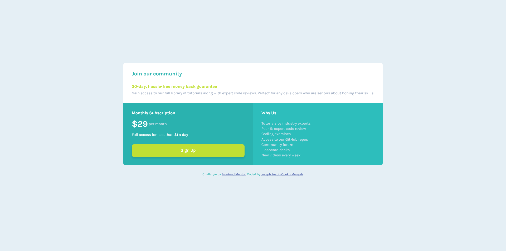

# Frontend Mentor - Single price grid component solution

This is a solution to the [Single price grid component challenge on Frontend Mentor](https://www.frontendmentor.io/challenges/single-price-grid-component-5ce41129d0ff452fec5abbbc). Frontend Mentor challenges help you improve your coding skills by building realistic projects.

## Table of contents

- [Overview](#overview)
  - [The challenge](#the-challenge)
  - [Screenshot](#screenshot)
  - [Links](#links)
- [My process](#my-process)
  - [Built with](#built-with)
  - [What I learned](#what-i-learned)
  - [Continued development](#continued-development)
  - [Useful resources](#useful-resources)
- [Author](#author)
- [Acknowledgments](#acknowledgments)

## Overview

### The challenge

Users should be able to:

- View the optimal layout for the component depending on their device's screen size
- See a hover state on desktop for the Sign Up call-to-action

### Screenshot

### Links

- Solution URL: [(https://github.com/JustinJoe/single-price-grid-component)]
- Live Site URL: [Add live site URL here](https://your-live-site-url.com)

## My process

### Built with

- Semantic HTML5 markup
- CSS custom properties
- Flexbox
- Mobile-first workflow

### What I learned

In this project, I learnt I need to take more time analysing designs so as to write better HTML. This will make coding easier and faster

### Continued development

- Animations
- Box shadows
- Transitions

### Useful resources

- [Transition on MDN](https://developer.mozilla.org/en-US/docs/Web/CSS/transitionm) - This gave me a good understanding of transitions to be able to implement it in the project.

## Author

- Website - [Joseph Justin Opoku Mensah](https://justinjoe.github.io/)
- Frontend Mentor - [@JustinJoe](https://www.frontendmentor.io/profile/JustinJoe)
- Twitter - [@justinjoe6](https://www.twitter.com/justinjoe6)

## Acknowledgments

Thanks to Frontend Mentor for providing this challenge.
